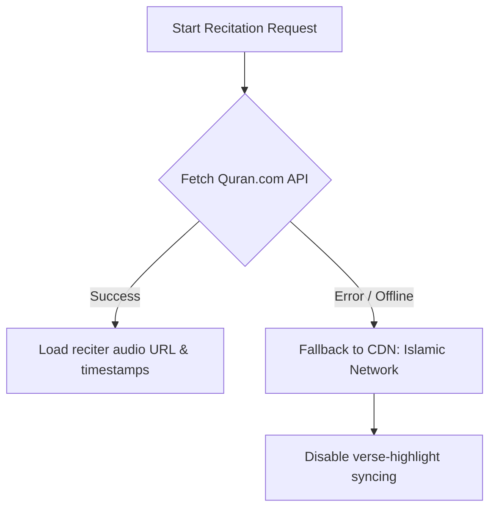

# External API & Network Integration

This document outlines the external API endpoints, parameters, and network fallback strategies implemented in Quran0 for audio recitation.

---

## 1. Quran.com Chapter Recitations API

To play audio recitations and sync them with active verse highlighting, Quran0 fetches data from the public Quran.com API.

### Endpoint

```http
GET https://api.quran.com/api/v4/chapter_recitations/{reciterId}/{surahId}?segments=true
```

### Path Parameters

- `reciterId` (integer): The unique identifier of the reciter. (e.g., `7` for Mishary Rashid Alafasy).
- `surahId` (integer): The surah number (`1` to `114`).

### Query Parameters

- `segments=true` (boolean): Requests millisecond-level word and verse timing arrays. This is required for active verse highlighting during playback.

---

## 2. API Response Contract

The API response is parsed and typed using the `AudioFileResponse` interface in `src/stores/audio.ts`:

```typescript
interface AudioFileResponse {
  audio_file: {
    audio_url: string
    timestamps?: TimestampSegment[]
  }
}

export interface TimestampSegment {
  verse_key: string
  timestamp_from: number // Start time in milliseconds
  timestamp_to: number // End time in milliseconds
  duration: number // Segment duration in milliseconds
}
```

### Timing Synchronization Logic

During playback, the current time of the HTML5 `<audio>` element is tracked in seconds. We multiply this value by `1000` to convert it to milliseconds and scan the `timestamps` array to find the matching verse:

```typescript
const currentTimeMs = time * 1000
const match = state.timestamps.find(
  (t) => currentTimeMs >= t.timestamp_from && currentTimeMs < t.timestamp_to,
)
// Result: match.verse_key (e.g. "78:4") is highlighted on screen
```

---

## 3. Offline and Error Fallback Strategy

To ensure high availability and robust offline support, the application employs a graceful degradation fallback when API requests fail (e.g., due to network loss or CORS blocks).



### Fallback CDN

If the primary fetch fails, Quran0 bypasses the metadata API and directly streams recitation files from the Al Quran Cloud CDN:

```typescript
// Fallback URL pattern
;`https://cdn.islamic.network/quran/audio-surah/128/ar.alafasy/${surahId}.mp3`
```

When operating in fallback mode:

- Audio streams and controls (Play, Pause, Autoplay, Repeat) remain fully functional.
- Timing-based features (active verse card highlights and click-to-seek verse timing) are temporarily disabled.
- An warning log is printed to the developer console detailing the API error.
