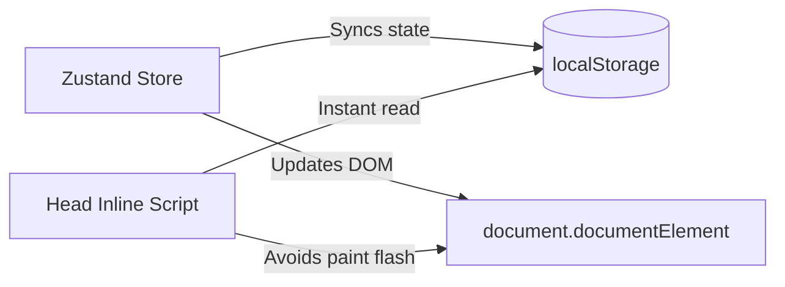

# Framework & Architecture

This document describes the routing, theming, settings, page animations, and development framework details of Quran0.

---

## 1. Core Framework (TanStack Start & Nitro)

Quran0 is built on **TanStack Start**, a full-stack React framework utilizing Vite, TanStack Router, and Nitro for compilation and rendering.

### Rendering Strategy

- **Static Prerendering**: During the production build phase, all routes (including home, progress, bookmarks, and all 114 surah details routes) are prerendered into static HTML files.
- **Client Hydration**: Once loaded in the browser, the site hydrates into a fast, interactive Single Page Application (SPA). Subsequent page navigations are executed client-side without reloading the page.

---

## 2. File-Based Routing

The router uses TanStack Router's directory structure inside `src/routes/`:

- `__root.tsx`: Injects meta tags, sets the iOS mobile envelopes, triggers the initial paint theme script, and mounts the global layout.
- `index.tsx` (`/`): The homepage displaying the list of all 114 surahs. Supports sorting by standard Quranic order, or by learning difficulty order (Easiest / Hardest).
- `surah.$surahId.tsx` (`/surah/$surahId`): Reader route containing Arabic texts, phonetic transliterations, translations, play/bookmark actions, and dynamic navigation.
- `bookmarks.tsx` (`/bookmarks`): Displays bookmarked surahs sorted in ascending Quranic order.
- `progress.tsx` (`/progress`): Reading/memorization statistics tracker.
- `motivation.tsx` (`/motivation`): Encourages learning with Quranic quotes.
- `memorize.tsx` (`/memorize`): Audio looping helper tools.

---

## 3. Theming & Settings Engine

Quran0 offers four curated color palettes: Dark, White, Sepia, and Green.



### Theming Flash Prevention

Because stylesheets load async, reading state inside React components during hydration can cause a bright white flash on dark mode devices. To bypass this, an inline blocking script is injected inside the `<head>` in `src/routes/__root.tsx`:

```javascript
;(() => {
  try {
    const value = JSON.parse(localStorage.getItem('quran0-theme') || 'null')
      ?.state?.theme
    document.documentElement.setAttribute(
      'data-theme',
      ['dark', 'white', 'sepia', 'green'].includes(value) ? value : 'dark',
    )
  } catch {
    document.documentElement.setAttribute('data-theme', 'dark')
  }
})()
```

This runs synchronously before the browser renders the first paint, applying CSS variable tokens immediately.

### Custom Font Resizing

Reader preferences (Arabic, English, and Bengali font size in pixels; transliteration/translation toggles) are updated dynamically using CSS custom variables bound to the root element:

```typescript
useEffect(() => {
  const root = document.documentElement
  root.style.setProperty('--arabic-fs', `${arabicFontSize}px`)
  root.style.setProperty('--english-fs', `${englishFontSize}px`)
  root.style.setProperty('--bengali-fs', `${bengaliFontSize}px`)
  root.style.setProperty('--show-en', displayEnglishSpelling ? 'block' : 'none')
  root.style.setProperty('--show-bn', displayBengaliMeaning ? 'block' : 'none')
}, [
  arabicFontSize,
  englishFontSize,
  bengaliFontSize,
  displayEnglishSpelling,
  displayBengaliMeaning,
])
```

---

## 4. Snappy Route Swipe Navigation

To mimic a native mobile reading application, users can swipe left or right on the surah screen to switch to the next or previous surah.

### Swipe Hook (`src/hooks/use-horizontal-swipe.ts`)

Tracks pointer movements and triggers callback navigation when a specific delta-x threshold is crossed.

### Swipe Animation Safeguards

To prevent swipe animations from triggering on initial page reload, the app tracks load states in `src/routes/__root.tsx`:

- At bundle load, `(window as any).__quran0_first_load = true` is set.
- A client effect resets it to `false` after `500ms`.
- If `__quran0_first_load` is true, the route component disables entrance animations. This keeps search engine crawlers (SEO) and initial reloads clean, while keeping client-side navigations fluid.
