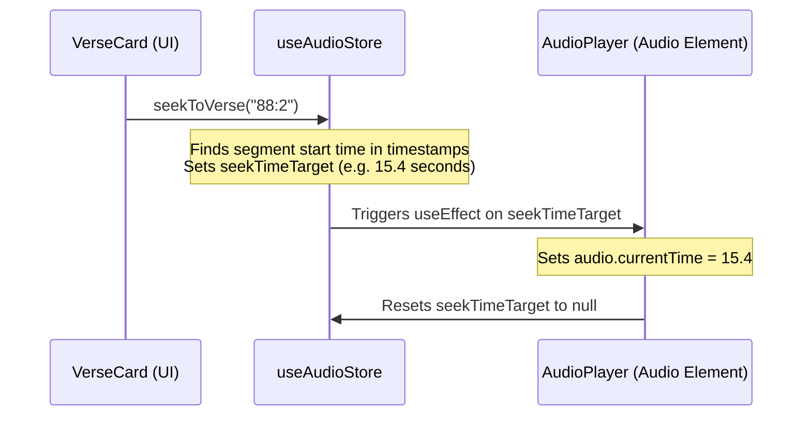

# Audio Playback & Synchronization Engine

This document explains the global state management, HTML5 audio integration, click-to-seek, and system media session integration used to power Quran0's recitation capabilities.

---

## 1. State Management (`useAudioStore`)

The audio player is controlled globally using a Zustand store (`src/stores/audio.ts`).

### State Split

- **Persisted Preferences**: Settings persisted to `localStorage` under `quran0-audio-settings`:
  - `autoplay`: Automatically play the next Surah when the current one finishes.
  - `repeat`: Repeat/loop the current Surah.
  - `playbackRate`: Speeds (`1.0x`, `1.5x`, `2.0x`).
  - `reciterId`: Selected reciter ID (supports Mishary Alafasy, Siddiq al-Minshawi, etc.).
- **Transient Playback State**: In-memory state reset on reload or player close:
  - `currentSurahId`, `isPlaying`, `currentTime`, `duration`, `isBuffering`, `audioUrl`, `timestamps`, `activeVerseKey`, `seekTimeTarget`.

---

## 2. Race Condition Handling (Play/Pause Queue)

HTML5 Audio's `.play()` method returns a Promise. If a pause request is made before this promise resolves, the browser throws a `DOMException` error. To prevent this, `src/components/audio-player.tsx` implements a promise-safe synchronization queue using `playPromiseRef`:

```typescript
const playPromiseRef = useRef<Promise<void> | null>(null)

useEffect(() => {
  const audio = audioRef.current
  if (!audio || !audioUrl) return

  if (isPlaying) {
    if (playPromiseRef.current) return // Already loading

    const promise = audio.play()
    playPromiseRef.current = promise
    promise
      .then(() => {
        playPromiseRef.current = null
        // Ensure user hasn't paused while play resolved
        if (!useAudioStore.getState().isPlaying) {
          audio.pause()
        }
      })
      .catch((err) => {
        playPromiseRef.current = null
        if (useAudioStore.getState().isPlaying) {
          setPlaying(false)
        }
      })
  } else {
    if (playPromiseRef.current) {
      // Wait for play to finish resolving before pausing
      playPromiseRef.current.then(() => {
        if (!useAudioStore.getState().isPlaying) {
          audio.pause()
        }
      })
    } else {
      audio.pause()
    }
  }
}, [isPlaying, audioUrl])
```

---

## 3. Click-to-Seek Syncing

Users can jump directly to the recitation of any verse by tapping the corresponding verse card on the surah page.



---

## 4. Media Session API (OS Lock Screen Integration)

Quran0 integrates natively with mobile and desktop operating systems via the browser's `navigator.mediaSession` API. This displays the currently playing Surah's title, reciter name, and artwork on the device lock screen, and hooks up hardware/headset media buttons.

### Controls Registered

- **Play/Pause**: Responds to system play/pause commands.
- **Next/Previous Track**: Jumps to the next or previous Surah.
- **Scrubbing/Position State**: Syncs the playhead progress in real-time to allow scrubbing directly from the OS notification shade:

```typescript
navigator.mediaSession.setPositionState({
  duration: duration,
  playbackRate: playbackRate,
  position: Math.max(0, Math.min(currentTime, duration)),
})
```
